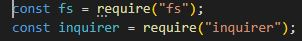
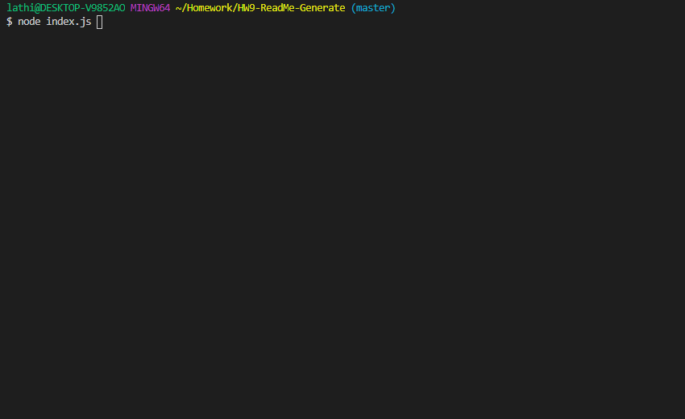

# HW9-Password-Generator

## Description

- Using a command-line application, it will dynamically generate a ReadMe.md file from user's input. The user will be prompted for their GitHub username and the following:

1. Project title
2. Description
3. Table of Contents
4. Installation
5. Usage
6. License
7. Contributing
8. Tests
9. Questions

## Technologies Used:
```
1. Javascript
2. Node
3. ScreentoGif
```
## Essential Code



- These are the required npm installs for this project. The fs is to write files and is already part of javascript. Inquirer is used to create prompts for the user to add input and be able to display the response in a ReadMe file.

## Gif Walkthrough

> 